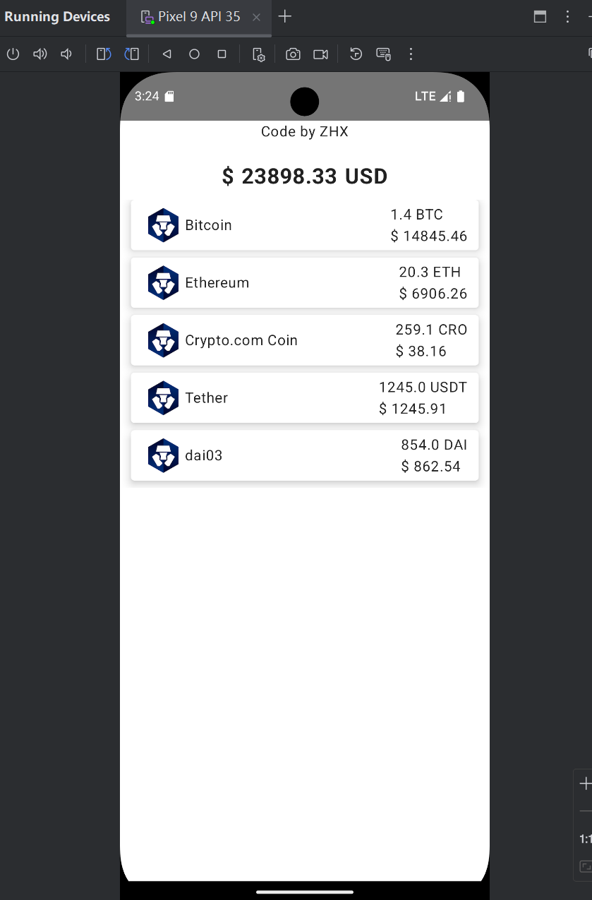

This is a Kotlin Multiplatform project targeting Android, iOS, Web, Desktop, Server.

* `/composeApp` is for code that will be shared across your Compose Multiplatform applications.
  It contains several subfolders:

  Run ComposeApp on Android and here we go:

